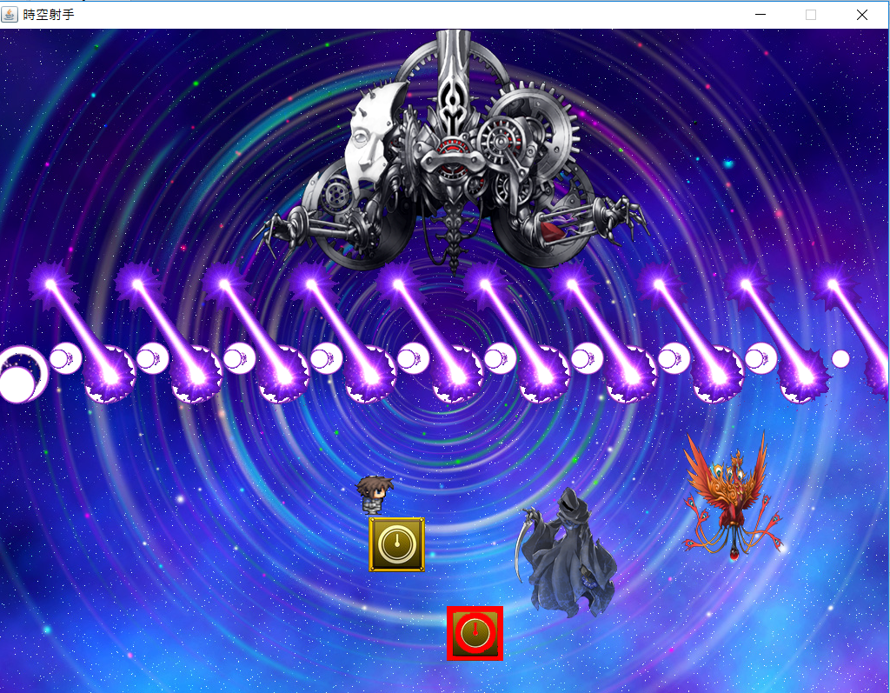

Java Final Project
===
The project was made by myself with Java.

- 2D shooting game
- use **[dyn4j](http://www.dyn4j.org/)** as physical engine
- it's a prototype, complete detail was written in FP_104502518/104502518_A.docx & FP_104502518/RamaProject.pptm

All media sources are in **FP_104502518/mysource/Ref.txt**

  
